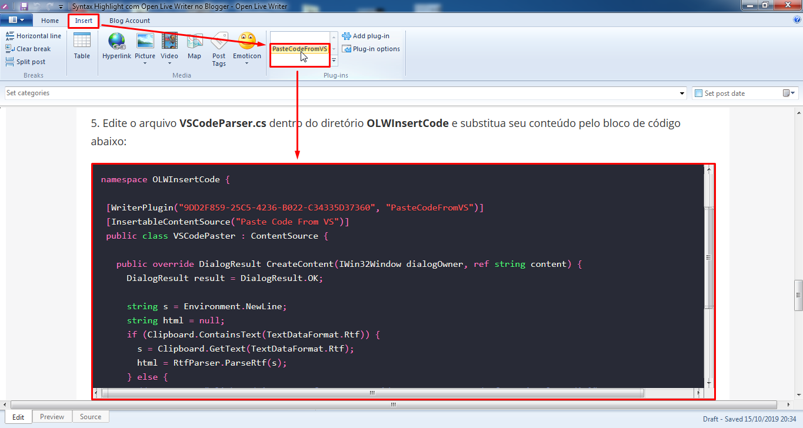

Open Live Writer paste code
===

_Fork from [OLWInsertCode](https://github.com/coldscientist/OLWInsertCode) to allow pasting code from any program into Open Live Writer_

Introduction
---

There are a couple of ways to show syntax-highlighted code in your blog posts. The majority of solutions use some special JavaScript library that is loaded along with the page, and this styles your code `<pre>` blocks in the post client-side. All well and good, but unless you mess around with the CSS you're stuck with the color choices made by the JavaScript library. 

At the time I wrote this, I just wanted to mimic the color choices I'd set in Visual Studio. The nice thing about Visual Studio is that if you copy some code to the clipboard, it also adds an RTF (rich text format) version of the code alongside the plain text version. That RTF version contains all the font colors you'd set in Visual Studio, encoded as part of the RTF. This plug-in will look for an RTF encoding of some code in the clipboard and convert it to HTML with `<span>` elements galore. It also gets wrapped in a class-named `<pre>` code block so you can set some general CSS for all your code blocks in your posts.

[Notepad++](http://notepad-plus.sourceforge.net/uk/site.htm) has a plugin called "[NppExport]((https://stackoverflow.com/questions/3475790/copy-notepad-text-with-formatting))" (comes pre-installed) that allows you to copy to RTF, HTML and ALL

1. Select the Text
1. From the menu, go to Plugins > NPPExport (comes pre-installed) > Copy RTF to clipboard
1. A shortcut is to use: [Settings > Shortcut Mapper > Plugin Commands > Copy all Formats to clipboard] and set it to CTRL+SHIFT+C. CTRL+C to copy the raw text, CTRL+SHIFT+C to copy with formatting.

It is worth mentioning that **64-bit Notepad++ does not support Plugin Manager and NPPExport**.

Using with Open Live Writer
===

You may download it from [here](https://github.com/coldscientist/OLWInsertCode/releases).

By default OLW will look in the Plugins folder inside the application path (e.g: `C:\Users\UserName\AppData\Local\OpenLiveWriter\app-0.5.1.3\Plugins`) but this path will change as OLW auto-updates itself (i.e. the app number will change). Make sure you are not running Open Live Writer. To install copy the plugin to that path using the latest `…\app-x.x.x.x` folder present on your system. Each time OLW updates to a new version you will need to re-copy or move the plugin into the new `…\app-x.x.x.x` folder. Restart Open Live Writer.

Alternatively use this approach: OLW (like WLW before it) checks the registry for plugins too and so you can add a registry key telling OLW where to find the plugin. Whilst this feature is supported by OLW this should enable the plugin to survive OLW auto updates without you having to do anything. Just download and extract the plugin to a folder on your harddrive and then add a new registry key to `HKEY_CURRENT_USER\SOFTWARE\OpenLiveWriter\PluginAssemblies` with the name (can be anything) and the location of the plugin. For example:


To paste some code, highlight and copy it from any RTF program. Switch to Open Live Writer, go to the Insert tab, and look in the Plug-ins ribbon group. Select PasteCodefromVS and the code will be inserted into the document, as formatted in the program you copied the text from.



Compilling
===

Compilling the code with Visual Studio or MSBuild will produce a DLL called `OLWInsertCode.dll`.

1. You'll need to edit `OLWInsertCode.csproj` file and change `OpenLiveWriter.Api` Reference directory with your Open Live Writer installation directory.
1. You can compile the code through Visual Studio or through MSBuild (doesn't require Visual Studio) typing the following command at **Command prompt**:

```
C:\Windows\Microsoft.NET\Framework\v4.0.30319\msbuild.exe "C:\Users\hp\Documents\GitHub\OLWInsertCode\OLWInsertCode\OLWInsertCode.csproj"
```

Code block format
===

The code will be wrapped in a special code block like this:

`<div class=\"jmbcodeblock\"><pre>` _your formatted code_ `</pre></div>`

You can then style both the `.jmbcodeblock` and `.jmbcodeblock pre` selectors as you wish. As an example, in my main blog's CSS I use:

```
div.jmbcodeblock {
	margin-bottom: 30px;
}
pre {
	font-size: 16px;
	border: 1px solid #ccc;
	max-height: 400px;
	background-color: rgb(40, 42, 54);
	padding: 1em;
	margin: .5em 0;
	overflow: auto;
	color: rgb(248, 248, 242);
	text-shadow: 0 1px rgba(0,0,0,0.3);
	font-family: Consolas,SFMono-Regular,Liberation Mono,Menlo,monospace;
	text-align: left;
	white-space: pre;
	word-spacing: normal;
	word-break: normal;
	word-wrap: normal;
	line-height: 1.5;
	tab-size: 4;
	hyphens: none;
}
```
